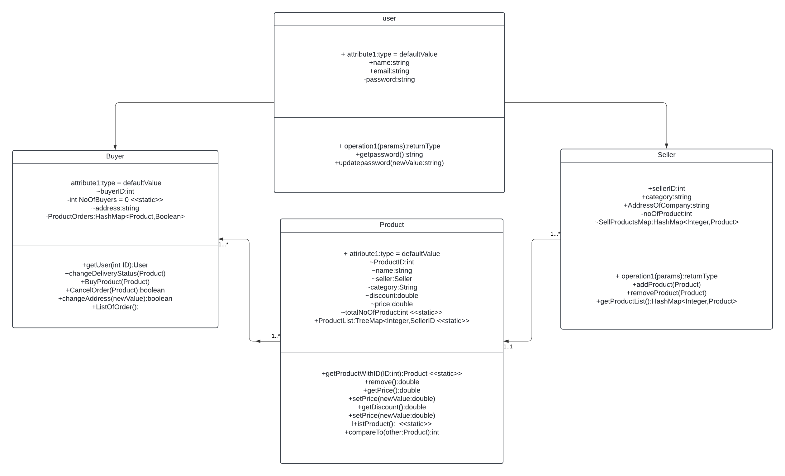

## Problem Statement V1
Create An Online Shopping System with Sellers and Buyer
## Solution Proposed
- Created Buyer and seller extending user class
- Product class with its details
- An Order class for keep tracking the orders done by the customers and product
- Implemented HashMaps for keep tracking of users and seller and their products
- Implemented TreeMap for track product list for displaying in a particular order
- Several methods were implemented with for user and sellers for handling the products
## Class Diagram
